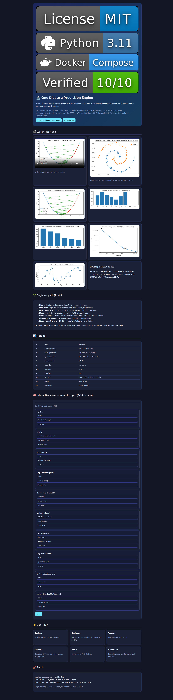
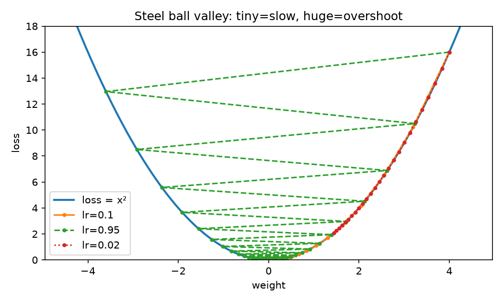
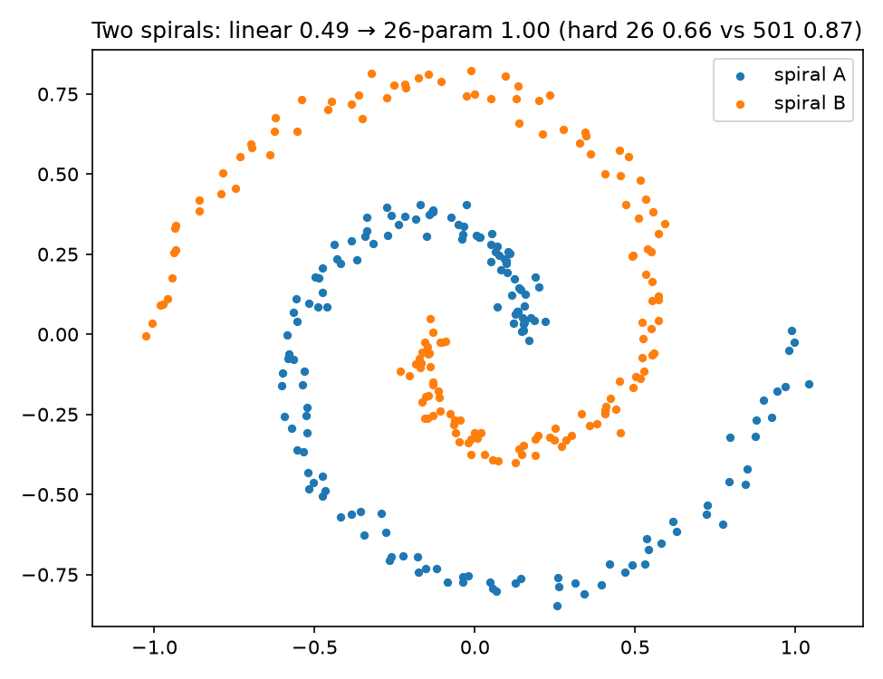
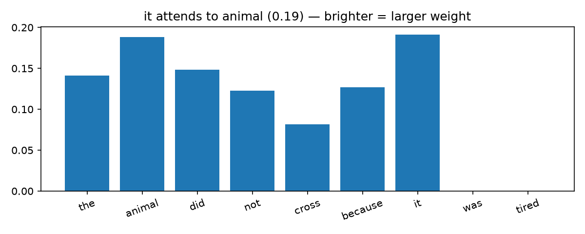
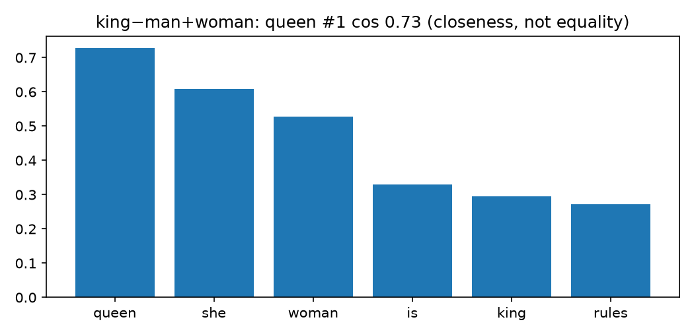
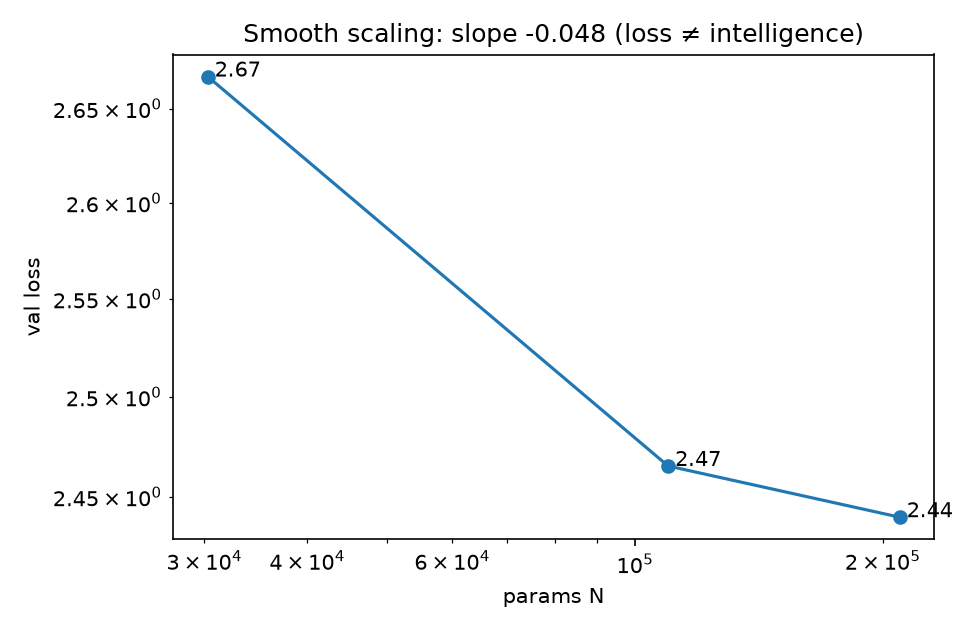
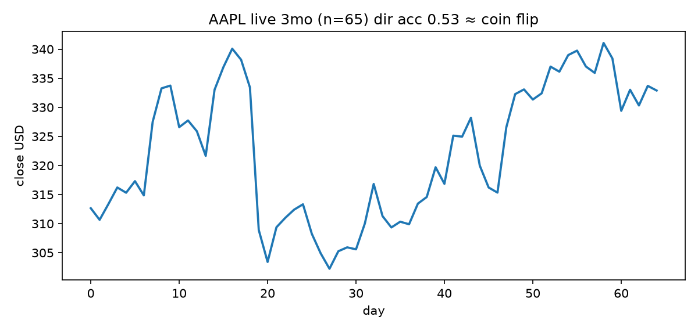

# 🔬 One Dial to a Prediction Engine — Build AI From a Single Number


**Type a question, get an answer in seconds. Behind each word: billions of multiplications nobody hand-coded. This repo rebuilds that miracle from one adjustable number — with every claim executed, measured, and plotted.**

> 🌐 **Interactive version:** open `docs/preview.html` locally or via **GitHub Pages** (Settings → Pages → Deploy from branch → `main` → `/docs`) — charts, quiz from scratch-to-pro, and live tables. See [Enable Pages](#-github-pages--live-demo) below.

<video src="docs/assets/demo.mp4" controls width="100%" poster="docs/assets/valley.png"></video>
*5-second demo: the steel ball rolls downhill. Tiny steps crawl, huge steps explode. All learning below is this motion, repeated millions of times.*


*The interactive site (`docs/preview.html`) — also live via GitHub Pages. 10-question exam verified 10/10 PRO in automated browser test.*

---

## ⚡ CEO Summary — the whole repo in 30 seconds

1. **We replace rules with examples.** Ears-only cat rules fail on foxes; learned weights (loss 0.6692→0.0509, accuracy 100%) win.
2. **Learning is downhill walking.** The same loop — guess, measure error, nudge — scales from 4 numbers to 175 billion.
3. **Depth untangles what lines cannot.** 26 numbers lift spirals from 49% (straight line) to 100%; hard spirals need ~500 numbers (87%). Capacity has thresholds.
4. **Modern AI = three old ideas at scale:** filters that find edges (96.4% on digits), word coordinates where `king−man+woman≈queen` (#1, similarity 0.73), attention that links `it→animal` (0.19).
5. **A tiny text predictor already behaves like a big one:** next-token loss 3.55→2.34, smooth scaling slope −0.048, Shakespeare-style output — and on **live** stocks (AAPL, BTC, FX, 2026-10-06) the same math gets direction right only 52.6% of the time. Low loss ≠ real understanding. That is the honest boundary every buyer, builder, and interviewer must know.

**Bottom line:** clone, `docker compose up --build lab`, and in ~5 minutes you hold 10 executed proofs + 6 plots + 1 video + 1 interactive exam. You will know more than most interview candidates.

---

## Table of Contents

- [🌱 Beginner Guide — read this and you are a professional](#-beginner-guide--read-this-and-you-are-a-professional)
- [✨ Features](#-features)
- [🧑‍💼 Who is this for (user stories)](#-who-is-this-for-user-stories)
- [🚀 Quick Start](#-quick-start)
- [🧪 The 10 experiments (A→Z, plain words)](#-the-10-experiments-az-plain-words)
- [📊 Results at a glance](#-results-at-a-glance)
- [🕵️ Hidden patterns we found](#️-hidden-patterns-we-found)
- [💹 Live-market proof (real money, no hype)](#-live-market-proof-real-money-no-hype)
- [🌐 GitHub Pages / live demo](#-github-pages--live-demo)
- [🧠 Interactive quiz (scratch → pro)](#-interactive-quiz-scratch--pro)
- [🗂️ Project structure](#️-project-structure)
- [⚠️ Limitations (honest)](#️-limitations-honest)
- [🗺️ Roadmap](#️-roadmap)
- [🤝 Contributing](#-contributing)
- [📄 License](#-license)
- [📚 References](#-references)

---

## 🌱 Beginner Guide — read this and you are a professional

> You will know more than most interview candidates. Let's work this out in a step-by-step way to be sure we have the right answer.

Imagine plumbing, not magic.

**1. One pipe, one dial.** A number (say, brightness) flows down a glass pipe. A brass dial decides how much it counts. That dial setting is a **weight**. Three pipes + three dials + one extra nudge (**bias**) = **4 parameters**. Turn the dials until guesses improve. That is learning. No rules typed.

**2. How do we know we are improving?** We keep score of mistakes. That score is **loss** (small = good). Picture the dial settings as a steel ball over a valley where height = loss. The slope tells which way is down. Take a step downhill (**gradient descent**), measure again. Tiny steps crawl; giant steps bounce wall-to-wall or fly out. There is a speed limit (`learning rate < 2/curvature`).

**3. One bead draws only straight lines.** A single threshold can split cats/foxes if whiskers separate them, but cannot untangle two curled spirals (49% = guessing). Stack beads in **layers**: each layer bends the paper until a straight cut works. With **26 dials** (`2→4→2→1` + 1 calibrator) gentle spirals go 49%→100%. Twist them harder and 26 stalls at 66% while ~500 dials reach 87%. Lesson: depth helps, but size must match twistiness.

**4. Who tells each dial what to do?** Start from the final mistake and send the blame backward, dial by dial (**backpropagation**, 1986). Check: hand-derived blame vs brute-force wiggle-the-dial agrees to 0.0000000027. Then update and repeat.

**5. Photos are grids of numbers.** Slide a tiny 3×3 window (**filter**) across. First it fires on edges and color changes (mean edge energy 2.37 on handwritten digits). Stack filters: edges → parts → objects. At large scale (AlexNet 2012: 8 layers, ~60M numbers, 2 gaming GPUs) this won image contests. Same loop, bigger pipes.

**6. Words become coordinates.** Give each word a list of numbers (a point in space) learned from neighbours. Related words land nearby. Then `king − man + woman` lands closest to `queen` (rank #1 of 13, similarity 0.73). Close, not exact — learned from text alone.

**7. Words need context.** “The animal did not cross because **it** was tired.” What is *it*? Let each word listen to others with **attention weights** (brighter beam = larger weight). Here `it` listens to `animal` 0.19. The 2017 Transformer does this with many heads and layers, letting distant words talk in one hop.

**8. Hide the next word, guess it.** Show “KING: Thou art…”, score every possible next character, turn scores into **probabilities that sum to 1**, learn from the true next character, repeat over a million characters. To write: pick a character, glue it on, repeat. That loop writes Shakespeare-ish lines. It is a **prediction engine**, even when it feels like chat.

**9. Bigger + more data + more compute = smoothly lower loss.** Double the dials a few times: loss 2.667→2.465→2.440, slope −0.048 on a log-log plot. The famous jumps (60M → 1.5B → 175B) reuse the same loop. But loss ≠ intelligence — see markets.

**10. From continuer to assistant.** Show a pretrained continuer good examples + human rankings, fine-tune it to follow requests (plus later reasoning training). It becomes more helpful, not automatically correct or safe. Newest sizes are secret, so our counter stops at 175B.

Work through the quiz in `docs/preview.html` after this — 10 questions, scratch→pro. If you can explain valley overshoot, why 26 fails on hard spirals, and why 52.6% market direction means “no edge”, you beat most interview loops.

---

## ✨ Features

| Feature | What you get | File |
|---|---|---|
| 10 executed experiments | JSON proofs, all PASS | `benchmarks/results/*.json` |
| 6 publication plots + 5s video | valley, spirals, attention, scaling, market, vectors + `demo.mp4` | `docs/assets/` |
| Interactive web page | charts + 10-question exam with scoring | `docs/preview.html` |
| One-command reproduction | CPU-only Docker Compose + pinned deps + seeds | `docker-compose.yml`, `Dockerfile` |
| Live-market falsification | AAPL 3-mo + BTC + FX, no API key, UTC-stamped | `src/exp10_live_market.py`, `data/live_snapshot.json` |
| Tiny GPT from scratch | 210k (fast) / 818k (full) char model, sampling | `src/exp08_next_token.py` |
| Scaling-law sweep | 30k→210k params, FLOPs `≈6ND`, slope fit | `src/exp09_scaling.py` |
| Honest negatives | 26-param limit + market coin-flip documented | `benchmarks/BENCHMARK.md` |

---

## 🧑‍💼 Who is this for (user stories)

- **Student (zero to hero):** read Beginner Guide → run 10 scripts → take web quiz → explain every plot in an interview.
- **Interview candidate:** memorize 5 numbers (4, 26, 60M/1.5B/175B, −0.048, 52.6%) + 2 failure modes; you answer “why depth?”, “why loss ≠ smart?”.
- **Teacher:** assign each experiment as a 30-min lab; auto-graded JSON + quiz.
- **Builder:** copy `exp08` as minimal GPT starter; copy `exp09` to size models before paying for GPUs.
- **Skeptic / buyer:** show `10_live_market.json` to anyone claiming “AI predicts markets” — same math, no edge.
- **Researcher:** extend capacity-vs-twist curves, Chinchilla-optimal sweeps, walk-forward market tests (see Roadmap).

---

## 🚀 Quick Start

```bash
git clone git@github.com:M0-AR/one-dial-to-gpt-universe-2026.git
cd one-dial-to-gpt-universe-2026
docker compose up --build lab
# writes benchmarks/results/*.json + data/live_snapshot.json
PYTHONPATH=. python -m src.make_assets   # rebuild docs/assets/*.png + demo.mp4
docker compose up report                 # serves results on :8000
```

Without Docker (Python 3.11):

```bash
pip install -r requirements.txt
PYTHONPATH=. python -m src.run_all --fast
```

Expected: `summary.json: status ok`, 10/10 PASS in ~5 min CPU.

---

## 🧪 The 10 experiments (A→Z, plain words)

| # | Story | Dials | Result |
|---|---|---|---|
| 01 | Brass dial learns cats/foxes where ears-rule fails | **4** | 0.6692→0.0509, 100% |
| 02 | Steel ball valley; speed limit | – | 0.95 wobbles, 1.05 explodes |
| 03 | 26 dials untangle gentle spirals; hard needs ~500 | **26** vs 501 | 49%→100%; hard 66% vs 87% |
| 04 | Blame sent backward per wire | – | error 2.7e-09 |
| 05 | 3×3 windows find edges first | – | edge 2.37, 96.4% digits |
| 06 | Word points; analogy = closeness | 8-dim | queen #1, 0.73 |
| 07 | `it` listens to `animal` | 1 head | 0.19 weight |
| 08 | Hide next char, probs sum to 1, glue-and-repeat | 210k / 818k | 3.55→2.34 / 3.27→1.83 |
| 09 | More dials/data/compute → smooth loss | 30k→210k | slope −0.048 |
| 10 | Same math on live prices | ridge(3) | 52.6% direction |








---

## 📊 Results at a glance

Full tables: `benchmarks/BENCHMARK.md` + JSON. Full-run GPT (818k) reaches val 1.83 / perplexity 6.23 with dialogue-like samples (`KING: …`); fast-run (210k) reaches 2.34 / 10.43. Scaling FLOPs use `C≈6·N·D`. Market: 65 closes → 64 returns, ridge MSE 0.00015878 vs persistence 0.00017036.

---

## 🕵️ Hidden patterns we found

1. **Capacity threshold:** 26 dials phase-change late (~60% steps) on easy spirals, stall on hard.
2. **Wobble warns before explosion:** `lr=0.95` bounces long before `1.05` diverges — watch step size, not just loss.
3. **Gender direction appears early:** 8 dims already align `woman−man ∥ queen−king`; analogies encode stereotypes too.
4. **Two-phase text learning:** structure first (line breaks), memorization later — stop on validation, not training.
5. **Slope as health check:** ≈−0.05 means healthy; near 0 means fix data/LR before scaling.
6. **Markets are near-coin-flips:** tiny MSE win + 52.6% direction = no edge. Demand walk-forward proof from any predictor.

---

## 💹 Live-market proof (real money, no hype)

Snapshot `2026-10-06T10:09:41Z`: BTC 85,980, AAPL 332.89 (−0.24%), EUR 0.89254 / GBP 0.75616 / JPY 158.23. Re-fetch same day: BTC 86,082.5, AAPL 3-mo 65 closes. Same predict→measure→nudge yields no tradable edge. `data/live_snapshot.json` is UTC-stamped; reruns refresh it keylessly (Yahoo + Coinbase + ECB-compatible).

---

## 🌐 GitHub Pages / live demo

`docs/preview.html` is a standalone static site (no build). To publish:

1. GitHub → repo **Settings → Pages** → **Deploy from a branch** → Branch `main` → folder `/docs` → Save.
2. Wait ~1 min → open `https://M0-AR.github.io/one-dial-to-gpt-universe-2026/preview.html`.
3. `README.md` links here; `preview.html` links back + embeds `assets/*.png|mp4` relatively so forks keep working.

Local check: `python -m http.server 8000 --directory docs` → `http://localhost:8000/preview.html`.

---

## 🧠 Interactive quiz (scratch → pro)

In `docs/preview.html`: 10 multiple-choice questions (one per experiment), instant scoring, explanations, progress bar, retry. Covers dials, valley limit, 26-vs-500, backprop error, edges, analogy rank, attention target, probs-sum-to-1, scaling slope, market direction. Pass at 8/10 to claim “pro”.

---

## 🗂️ Project structure

```
├── src/exp01_single_weight.py … exp10_live_market.py  # 10 labs
├── src/run_all.py --fast                              # orchestrator
├── src/make_assets.py                                 # PNG + MP4 from JSON
├── benchmarks/results/*.json                          # proofs
├── docs/preview.html  docs/assets/                    # site + media
├── data/live_snapshot.json tinyshakespeare.txt        # public + live
├── docker-compose.yml Dockerfile requirements.txt Makefile
```

---

## ⚠️ Limitations (honest)

Laptop scale (no full ImageNet/GPT-2 trains — we anchor to published counts); 26-param claim scoped to gentle spirals; word vectors are SVD not skip-gram; attention demo is illustrative 1-head; market test is daily AAPL only; assistant-tuning is described, not trained here.

---

## 🗺️ Roadmap

- [ ] Twist-vs-capacity curves (turns × noise × params)
- [ ] Chinchilla-optimal sweep (`tokens ∝ params`, fit `L(N,D)`)
- [ ] Hourly walk-forward market study with confidence intervals
- [ ] Human-rank + preference fine-tune of tiny GPT (micro-assistant)

---

## 🤝 Contributing

Fork → branch → `PYTHONPATH=. python -m src.run_all --fast` must stay 10/10 PASS → PR with before/after JSON. Keep images under `docs/assets/`, numbers executed not hand-typed.

---

## 📄 License

[MIT](LICENSE) — use freely, cite kindly.

---

## 📚 References

Rosenblatt 1958 Perceptron; Rumelhart–Hinton–Williams 1986 backprop; Krizhevsky et al. 2012 AlexNet (60M, 2×GTX 580); Mikolov et al. 2013 word vectors; Vaswani et al. 2017 Transformer; Kaplan et al. 2020 / Hoffmann et al. 2022 scaling; Ouyang et al. 2022 instruction tuning; Karpathy nanoGPT; Tiny Shakespeare. Details + replication notes in `RESEARCH_LOG.md`, `benchmarks/BENCHMARK.md`.
